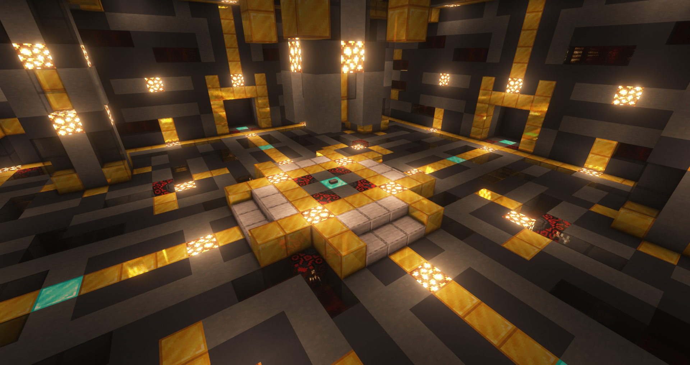

# KotaServer - Arena

## 概要
マルチプレイサーバー「KotaServer」のPvEアリーナ管理用データパックです。
 
### 使い方
  - セットアップ方法
    - ステージの中央にマーカー(tag=Arena.Normal-Stage.Core)を召喚
    - 入場待機場所と帰還場所でfunction(#arena_normal:marker_placement/entrance, #arena_normal:marker_placement/lobby)を実行
    - 任意の入場場所からfunction(#arena_normal:lobby_entrance)をプレイヤーから実行できるようにする

  以上のセットアップのみで、簡単にアリーナを動作させることが可能です。

  ## 注意点
    - 同梱ストラクチャを使用した場合のみサポートしています。
    - #arena_normal:marker_placement/lobby 実行時には, 引数にLobbyType(Normal|Endless)を設定してください。

### 動作環境
- Minecraft JE 1.20.2 -

### Special Thanks (敬称略)
- ayupara
- elecams
- Hiroki1003
- Kizuna_nAI
- kokuwa
- Youshow322
- yuu2132
